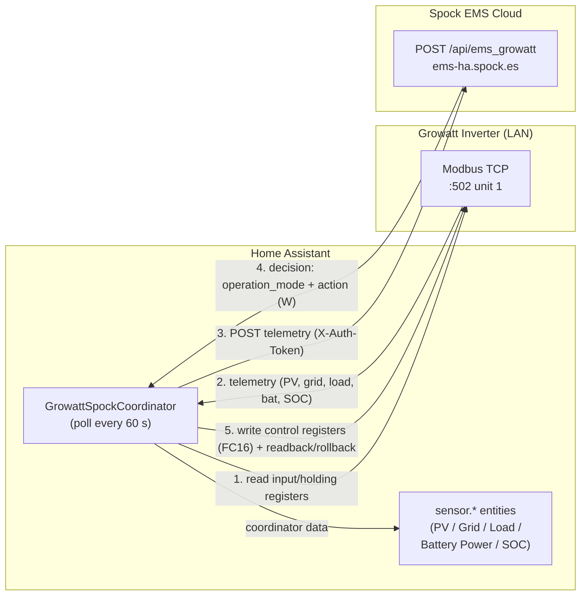

# Spock EMS (Growatt)

> Home Assistant custom integration that bridges a local **Growatt** hybrid inverter/battery to the **Spock Energy Management System** — reading telemetry over Modbus TCP and applying battery charge/discharge commands returned by Spock.

[](https://github.com/Spock-p2p/ha-spock_ems_growatt)
[](https://www.home-assistant.io/)
[](https://hacs.xyz/)
[](https://developers.home-assistant.io/docs/creating_integration_manifest#iot-class)
[](#entities)

---

## Overview

**Spock EMS (Growatt)** is a custom Home Assistant integration, part of the [Spock](https://spock.es) energy platform's **EMS (Energy Management System)**. It runs a closed control loop directly inside Home Assistant:

1. **Reads** live telemetry from a Growatt hybrid inverter over **Modbus TCP** (PV, grid, load and battery power, plus battery state of charge).
2. **Pushes** that telemetry to the Spock EMS cloud API.
3. **Receives** an optimisation decision back from Spock (charge / discharge / auto) and **writes** the corresponding battery control registers back to the inverter — safely, with backup, read-back verification and rollback.

This lets Spock orchestrate the battery (e.g. charge from grid during cheap hours, limit discharge, or hand control back to the inverter) using local Modbus access, while keeping all live data inside Home Assistant for dashboards and automations.

> The inverter is reached **locally** over your LAN (Modbus TCP). The Spock cloud endpoint is only used for the optimisation decision, not for reading the inverter — hence the `local_polling` IoT class.

---

## Features

- **Local Modbus TCP** polling of a Growatt hybrid inverter — no inverter cloud account needed for reading.
- **Five power/energy sensors** exposed to Home Assistant (PV, grid, load, battery power, battery SOC).
- **Automatic nominal-power detection** from the inverter on first read.
- **Closed-loop battery control** driven by the Spock EMS decision engine:
  - **Charge** — grid charging enabled, "Battery First" TOU window forced 24 h, charge rate set from a target wattage.
  - **Discharge / Load First** — grid charging disabled, "Load First" mode, discharge rate limited from a target wattage.
  - **Auto / none** — hands control back to the inverter (Load First, unrestricted).
- **Safety-first writes** (mirrors Spock's standalone control scripts):
  - All writes use **FC16** (`write_registers`).
  - **Backup → write → read-back → rollback** (best-effort) on every control cycle.
  - **Battery online check** before and after applying any command.
  - **Idempotent**: a command identical to the last one is skipped (less Modbus traffic, less wear).
- **Configurable battery power base (`battery_max_w`)** used to convert target watts into the inverter's percentage-based charge/discharge rate registers.
- **Robust pymodbus calling convention** — transparently supports `device_id` / `slave` / `unit` keyword across pymodbus versions.
- **Config flow + options flow** — set up and reconfigure entirely from the UI.
- **HACS-installable** as a custom repository.

---

## How it works / Architecture

The integration's `DataUpdateCoordinator` runs every **60 seconds**. Each cycle reads Modbus registers, posts telemetry to Spock, and applies any control action returned.



**Telemetry read** (Modbus input/holding registers, values scaled internally):

| Quantity | Source register(s) | Notes |
|----------|--------------------|-------|
| Nominal power | HR 10 or IR 3005–3006 | auto-detected once |
| PV power | IR 3001–3002 (u32, ×0.1 W) | |
| Battery SOC | IR 3010, fallback IR 3171 (BMS) | % |
| Battery power | IR 3178/3180 (u32, ×0.1 W) | charge − discharge (+charge / −discharge) |
| Grid power (net) | IR 3041 (to-user) − IR 3043 (to-grid) | +import / −export |
| Load power | IR 3045–3046 (u32, ×0.1 W) | |

**Control write** (Growatt TOU & rate holding registers):

| Register | Purpose |
|----------|---------|
| HR 3036 | Discharging power rate (%) |
| HR 3038–3043 | TOU Time1/Time2/Time3 config + end (mode bits, enable, time) |
| HR 3047 | Charging power rate (%) |
| HR 3049 | Grid charging enable (1/0) |

The Spock response drives the decision:

- `operation_mode = "charge"` → mode `charge_grid_batfirst`, charge target = `action` watts.
- `operation_mode = "discharge"` → mode `load_first`, discharge limit = `action` watts.
- `operation_mode = "auto"` / `"none"` (or `action = 0`) → mode `load_first`, unrestricted (9000 W).

Watt targets are converted to the inverter's percentage registers using `battery_max_w` as the 100 % base.

---

## Requirements & compatibility

| Item | Requirement |
|------|-------------|
| Home Assistant | **≥ 2024.6.0** |
| Python dependencies | `pysma==1.0.2`, `pymodbus>=3.6.0` (installed automatically by HA) |
| HA dependency | `http` |
| Inverter access | Growatt hybrid inverter reachable over **Modbus TCP** on your LAN (default port `502`, unit id `1`) |
| Spock account | A Spock EMS **API token** and **plant ID** (provided by Spock) |
| Network | Outbound HTTPS to `ems-ha.spock.es` for the optimisation decision |

> Tested against Growatt hybrid inverters that expose the standard SPH/SPA-family holding/input register map used above. Exact model/firmware coverage depends on register compatibility.

---

## Installation

### Option A — HACS (recommended)

1. In Home Assistant go to **HACS → Integrations → ⋮ (top-right) → Custom repositories**.
2. Add the repository:
   - **Repository:** `https://github.com/Spock-p2p/ha-spock_ems_growatt`
   - **Category:** `Integration`
3. Search for **Spock EMS (Growatt)** in HACS and install it.
4. **Restart** Home Assistant.

### Option B — Manual

Copy the integration folder into your Home Assistant configuration directory:

```bash
# from the repository root
cp -r custom_components/spock_ems_growatt /config/custom_components/
```

Resulting layout:

```
/config/custom_components/spock_ems_growatt/
```

Then **restart** Home Assistant.

---

## Configuration

After installing and restarting, add the integration from the UI:

1. Go to **Settings → Devices & Services → Add Integration**.
2. Search for **Spock EMS (Growatt)**.
3. Fill in the configuration form (see fields below).

The integration validates the Modbus TCP connection to the inverter during setup; if it cannot connect you'll see a **"Failed to connect to Inverter (Modbus TCP)"** error.

### Configuration fields

| Field (UI label) | Key | Required | Default | Description |
|------------------|-----|----------|---------|-------------|
| Spock API Token | `spock_api_token` | Yes | — | Auth token sent as `X-Auth-Token` to the Spock EMS API. |
| Spock Plant ID | `spock_plant_id` | Yes | — | Identifier of your plant in Spock; included in the telemetry payload. |
| Inverter IP Address | `inverter_ip` | Yes | — | LAN IP of the Growatt inverter / Modbus gateway. Also used as the unique id. |
| Modbus Port | `modbus_port` | No | `502` | Modbus TCP port. |
| Modbus Unit ID | `modbus_id` | No | `1` | Modbus slave / unit id of the inverter. |
| Battery base power (W) | `battery_max_w` | No | `9000` | Power used as the 100 % reference when converting watt targets into the inverter's % charge/discharge registers. Invalid values fall back to the default. |

> The polling interval is fixed at **60 seconds** in code and is not user-configurable.

### Options flow (reconfigure)

You can change any of the above later without removing the integration:

1. **Settings → Devices & Services → Spock EMS (Growatt) → Configure**.
2. Edit the fields and submit. The connection is re-validated and the entry is reloaded automatically.

---

## Entities

All entities are created on a single device named **`Growatt Inverter (<ip>)`** (manufacturer `Growatt`). Entity unique ids follow `growatt_<ip>_<key>`.

| Entity | Platform | Unit | Device class | State class | Description |
|--------|----------|------|--------------|-------------|-------------|
| Growatt Spock PV Power | `sensor` | W | `power` | `measurement` | Instantaneous PV (solar) generation. |
| Growatt Spock Grid Power | `sensor` | W | `power` | `measurement` | Net grid power: **positive = import**, **negative = export**. |
| Growatt Spock Load Power | `sensor` | W | `power` | `measurement` | Household/load consumption. |
| Growatt Spock Battery SOC | `sensor` | % | `battery` | `measurement` | Battery state of charge. |
| Growatt Spock Battery Power | `sensor` | W | `power` | `measurement` | Battery power: **positive = charging**, **negative = discharging**. |

> This integration provides the **`sensor`** platform only. Battery control is performed internally by the coordinator based on the Spock decision — there are **no** writable HA entities (no `number`, `switch`, `select`, `button`) and **no custom HA services**.

---

## Usage examples

### Energy Dashboard

The power sensors carry the correct `device_class` / `state_class` to be used in Home Assistant. The grid sensor is **net** (signed), so to feed the Energy Dashboard's separate import/export meters you can derive them with template/Riemann-sum helpers, e.g.:

```yaml
# configuration.yaml — split net grid power into import/export
template:
  - sensor:
      - name: "Grid Import Power"
        unit_of_measurement: "W"
        device_class: power
        state_class: measurement
        state: "{{ [states('sensor.growatt_spock_grid_power') | float(0), 0] | max }}"
      - name: "Grid Export Power"
        unit_of_measurement: "W"
        device_class: power
        state_class: measurement
        state: "{{ [states('sensor.growatt_spock_grid_power') | float(0), 0] | min | abs }}"
```

### Automation example — low battery notification

```yaml
automation:
  - alias: "Notify on low Growatt battery SOC"
    trigger:
      - platform: numeric_state
        entity_id: sensor.growatt_spock_battery_soc
        below: 15
    action:
      - service: notify.mobile_app
        data:
          title: "Battery low"
          message: >
            Growatt battery SOC is {{ states('sensor.growatt_spock_battery_soc') }}%.
```

---

## Troubleshooting / FAQ

**Setup fails with "Failed to connect to Inverter (Modbus TCP)".**
The integration could not open a Modbus TCP socket to `inverter_ip:modbus_port`. Check that the IP is correct, the inverter/gateway is on the network, port `502` (or your custom port) is reachable, and the Modbus unit id matches.

**Sensors show "unknown" briefly.**
The coordinator keeps the **last valid value** when a poll cycle returns no data, so transient Modbus hiccups shouldn't blank the sensors. A persistent "unknown" indicates the inverter isn't responding.

**Battery control doesn't seem to apply.**
Control is only applied when Spock returns `status: ok` (or no status) with an actionable `operation_mode`. Identical consecutive commands are intentionally skipped. The battery must report **online** both before and after the write, otherwise the change is rolled back. Enable debug logging to follow the decision and read-back trace.

**Grid / battery power sign looks inverted.**
By convention here: grid power is **+import / −export**, battery power is **+charging / −discharging**.

### Enable debug logging

```yaml
# configuration.yaml
logger:
  default: info
  logs:
    custom_components.spock_ems_growatt: debug
```

This logs the Modbus reads, the exact JSON payload sent to Spock, the decision received, and every control write with its read-back/rollback result.

---

## Project structure

```text
custom_components/spock_ems_growatt/
├── __init__.py            # Entry setup/unload; creates the coordinator, forwards the sensor platform, closes Modbus on HA stop
├── config_flow.py         # UI config flow + options flow; validates the Modbus TCP connection
├── const.py               # Domain, config keys, defaults (port 502, unit 1, battery_max_w 9000), scan interval, Spock API endpoint
├── coordinator.py         # Core: Modbus telemetry read, push to Spock, decode decision, safe battery control (backup/readback/rollback)
├── sensor.py              # The 5 sensor entities (PV / Grid / Load / Battery Power / Battery SOC)
├── manifest.json          # Integration metadata, requirements (pysma, pymodbus), version 1.1.0
└── translations/
    ├── en.json            # English UI strings
    └── es.json            # Spanish UI strings
```

---

## Credits

- **Code owner / maintainer:** [@Spock-p2p](https://github.com/Spock-p2p)
- Part of the **Spock EMS** (Energy Management System) — [spock.es](https://spock.es)
- Repository: <https://github.com/Spock-p2p/ha-spock_ems_growatt>

## License

No license file is currently distributed with this repository. All rights reserved by Spock (Spock-p2p) unless a `LICENSE` file is added.
